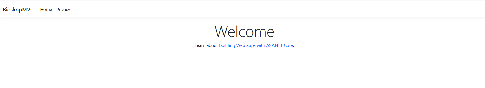

# BioskopMVC

**BioskopMVC** je ASP.NET Core MVC veb aplikacija za upravljanje bioskopskim rezervacijama, kao i za dodavanje, menjanje i uklanjanje određenih podataka. Aplikacija sadrži dva tipa korisnika:

## 1. Korisnik (Customer):
- Može da pregleda trenutnu ponudu filmova.
- Može da izlistava filmove prema određenim kriterijumima.
- Može da rezerviše karte.

## 2. Administrator (Admin):
Ima pristup upravljanju sledećim entitetima:
- **Bioskop (Cinema)**
- **Bioskopske sale (CinemaHall)**
- **Raspored sedenja (SeatingArea)**
- **Film(Movie)**
- **Glumac(Actor)**
- **Reditelj(Director)**
- **Osoba(Person)**
- **Nacionalnost(Nationlity)**

### Entiteti:
- **Film (Movie)**: Entitet koji povezuje glumca i reditelja 
- **Glumac (Actor)**: Entitet koji predstavlja glumca u filmu.
- **Reditelj (Director)**: Entitet koji predstavlja reditelja filma.
- **Nacionalnost (Nationality)**: Utice na klasu **Person**, koju nasleđuju **Actor**, **Director**, **Admin**, i **Customer**.
- **Osoba (Person)**: Baza za kreiranje drugih entiteta poput **Actor**, **Director**, **Admin**, i **Customer**.
- **Bioskop(Cinema)** - Osnova za kreiranje bioskopa, sadrzi naziv, lokaciju, broj sala, broj sedista
- **BioskopskaSala(CinemaHall)** - Bisokospska sala je slab objekat i vezuje za za bioskop cime omogucava da u Bioskopu mozemo da imamo vise sala koje pustaju u raznim terminima razlicite filmove
- **SedajuciDeo(SeatingArea)** Deo bioskopskih sala na kojima se sedi i zaduzene su za podele koristeci broj sedista, red, naziv.
  

### Administratorske funkcionalnosti:
Administrator može da:
- Kreira, menja i briše entitete povezane sa filmovima (**Movie**, **Actor**, **Director**,**Cinema**, **CinemaHall**, **SeatingArea**,**Person**, **Nationality**).

Aplikacija  je  planirano da bude slicna  kao što je primenjeno na sajtu [Cineplexx](https://www.cineplexx.rs/).


## Pokretanje projekta
### Potrebni alati
- **.NET SDK (verzija X.X ili novija)**
- **SQL Server ili drugi sistem za upravljanje bazama podataka**
- **Entity Framework (opciono, ako se koristi za pristup bazi podataka)**

### Instalacija
1. Klonirajte repozitorijum:

```bash
    git clone https://github.com/yourusername/BioskopMVC.git
```

2. Uđite u direktorijum projekta:
```bash
      cd BioskopMVC
```

3. Restorujte potrebne NuGet pakete:
```bash
      dotnet restore
```

4. Konfigurišite konekcioni string za bazu podataka u appsettings.json fajlu:

```json

    {
      "ConnectionStrings": {
        "DefaultConnection": "Server=ime_vasih_servera;Database=bioskopmvc;Trusted_Connection=True;"
      }
    }
```
5. Pokrenite aplikaciju:

```bash

    dotnet run
```
6. Otvorite pregledač i idite na https://localhost:5001 kako biste pristupili aplikaciji.


## Trenutni prikaz aplikacije 



## Status zadatka 
 - [x] Kreiran osnovni model aplikacije
 -  

### Nationalities

- [x] Kreirana tabela
- [x] Partialview  - lista nacionalnosti
- [x] Create  - kreiranje nove nacionalnosti
- [x] Edit  - modifikovanje postojece
- [x] Delete - brisanje postojece nacionalnosti

### Person

- [ ] Kreirana tabela
- [ ] Prikaz
- [ ] Create  - 
- [ ] Edit  - 
- [ ] Delete - 

- ### Actor

- [ ] Kreirana tabela
- [ ] Prikaz - 
- [ ] Create  - 
- [ ] Edit  - 
- [ ] Delete - 

### Director

- [ ] Kreirana tabela
- [ ] Peikaz  
- [ ] Create  -
- [ ] Edit  - 
- [ ] Delete -

- ### Movie

- [ ] Kreirana tabela
- [ ] Peikaz  
- [ ] Create  -
- [ ] Edit  - 
- [ ] Delete - 

 ### Cinema

- [ ] Kreirana tabela
- [ ] Peikaz  
- [ ] Create  -
- [ ] Edit  - 
- [ ] Delete -

- ### CinemaHall

- [ ] Kreirana tabela
- [ ] Peikaz  
- [ ] Create  -
- [ ] Edit  - 
- [ ] Delete -

- ### SeatingArea

- [ ] Kreirana tabela
- [ ] Peikaz  
- [ ] Create  -
- [ ] Edit  - 
- [ ] Delete -

## Nationalities 

-[x] - Kreirana tabela u bazi 
`[Kreirana tabela ](./images/NationalitiesTabela)`

- [x] -Lista nacionalnosti
`[Lista nacionalnosti](./images/GetNacionity)`

      
